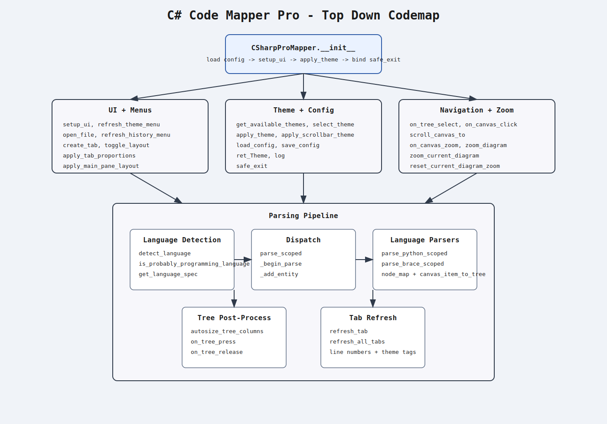

#  ______   ______   _______   _______   _______   _______   _______
# / ____/  / ____/  / ____  | /  __  /  / ____  | /  __  /  / ____  |
#/ /      / /      / /   / / / / / /   / /   / / / /_/ /   / /___/ /
#\ \____  \ \____  \ \__/ / / /_/ /    \ \__/ / /  __ /    / ____  /
# \____/   \____/   \_____/  \____/      \_____/ /_/  \_\  /_/   /_/
#
#                     C# Code Mapper Pro

`C# Code Mapper Pro` is a Tkinter desktop application that opens source files, parses structural entities (class/method/variable/function), and visualizes them in:
- Built with Codex\Python\TKinter
- a `Treeview` explorer
- a node-link diagram canvas
- a source code viewer with synchronized navigation

## Top-Down Codemap

## Core Features
- Multi-tab source browsing
- Theme system with selectable palettes (including monochrome lime)
- Recent file history with persistence in `config.json`
- Diagram zoom (`Ctrl+MouseWheel`, keyboard shortcuts, menu)
- Tree-to-diagram/code and diagram-to-tree/code synchronization
- Language detection and multi-language parsing (plus fallback for unknown text)
- Diagram screenshot export (`.png` with PIL or `.ps` fallback)

## Parsable Languages
The parser can currently detect and attempt structural parsing for the following languages (via extension/content heuristics):

- `C#` (`.cs`)
- `Java` (`.java`)
- `JavaScript` (`.js`, `.jsx`)
- `TypeScript` (`.ts`, `.tsx`)
- `Python` (`.py`)
- `Go` (`.go`)
- `Rust` (`.rs`)
- `C` (`.c`, `.h`)
- `C++` (`.cpp`, `.cc`, `.cxx`, `.hpp`)
- `PHP` (`.php`)
- `Swift` (`.swift`)
- `Kotlin` (`.kt`, `.kts`)
- `Scala` (`.scala`)
- `Dart` (`.dart`)
- `Ruby` (`.rb`)
- `Lua` (`.lua`)
- `Perl` (`.pl`)
- `R` (`.r`)
- `Objective-C` (`.m`, `.mm`)
- `Solidity` (`.sol`)
- `F#` (`.fs`, `.fsi`, `.fsx`)
- `Visual Basic` (`.vb`)
- `Pascal` (`.pas`)
- `Nim` (`.nim`)
- `Zig` (`.zig`)
- `Haskell` (`.hs`)
- `Elixir` (`.ex`, `.exs`)
- `Erlang` (`.erl`)
- `Clojure` (`.clj`)
- `Groovy` (`.groovy`)
- `Malbolge` (`.mal`, `.mbg`, `.malbolge`)

`Unknown` file types are still checked with a code-likeness heuristic; if they look like source code, the generic parser is used.

## Function Reference
All functions below are from `csharp_scan_main.py`.

### `ConfigHandler`
| Function | Description |
|---|---|
| `__init__(self, d)` | Stores the provided dictionary directly into `self.__dict__` for simple attribute-style access. |
| `from_json(cls, fh)` | Class constructor helper that loads JSON from a file handle and returns `ConfigHandler`. |

### `LineNumberCanvas`
| Function | Description |
|---|---|
| `__init__(self, master, text_widget, **kwargs)` | Initializes a canvas tied to a text widget and sets default line-number color. |
| `redraw(self, *args)` | Recomputes and paints visible line numbers based on the linked text widget viewport. |
| `set_theme(self, bg, fg)` | Applies background and line-number foreground color for theme changes. |

### `CSharpProMapper` - App Lifecycle and Configuration
| Function | Description |
|---|---|
| `__init__(self, root)` | Initializes app state, loads config, builds UI, applies theme, and sets close handler. |
| `load_config(self, filename='config.json')` | Loads app config JSON relative to script location; handles missing/invalid file safely. |
| `save_config(self)` | Writes current config to `config.json` with indentation. |
| `log(self, msg)` | Appends timestamped messages to the terminal pane and auto-scrolls to latest line. |
| `safe_exit(self)` | Persists current window size/config and closes the app cleanly. |

### `CSharpProMapper` - Theme Management
| Function | Description |
|---|---|
| `get_available_themes(self)` | Returns theme registry used by the Settings theme selector. |
| `get_theme_colors(self, theme)` | Resolves a theme key to its color dictionary (fallback to dark). |
| `refresh_theme_menu(self)` | Rebuilds the Settings -> Themes menu and marks current theme. |
| `select_theme(self, theme)` | Applies selected theme and immediately persists the choice to config. |
| `apply_theme(self, theme)` | Applies colors to ttk styles/widgets, refreshes tabs/scrollbars, and logs change. |
| `ret_Theme(self, theme)` | Small helper returning only `{bg, fg}` for widget construction. |
| `apply_scrollbar_theme(self)` | Walks widget tree and updates `tk.Scrollbar` colors to match active theme. |

### `CSharpProMapper` - UI Construction and Layout
| Function | Description |
|---|---|
| `setup_ui(self)` | Builds menus, panes, notebook, terminal, bindings, history/theme menus, and startup layout behavior. |
| `refresh_all_tabs(self)` | Re-runs `refresh_tab` for all open tabs after global updates (e.g., theme). |
| `create_tab(self, path)` | Creates a new notebook tab with tree, diagram, code, scrollbars, and event bindings. |
| `schedule_tab_proportions(self, tid)` | Defers tab pane-width ratio recalculation to idle cycle. |
| `apply_tab_proportions(self, tid)` | Applies width ratios across visible tab sections (tree/diagram/code). |
| `schedule_main_pane_layout(self)` | Defers top/bottom main pane split adjustment to idle cycle. |
| `apply_main_pane_layout(self)` | Enforces default notebook/console vertical split (until user manually changes it). |
| `on_main_pane_mouse_release(self, event)` | Detects sash drag and disables automatic console sizing when user adjusts manually. |
| `toggle_layout(self)` | Shows/hides tree/diagram/code sections based on menu toggles and reapplies proportions. |

### `CSharpProMapper` - File and History Operations
| Function | Description |
|---|---|
| `open_file(self)` | Opens file picker with multi-language filters and creates a new parsing tab. |
| `open_recent_file(self, path)` | Opens a recent file if available; removes stale paths and warns if missing. |
| `add_recent_file(self, path)` | Deduplicates, prepends, truncates, and persists recent file history. |
| `refresh_history_menu(self)` | Rebuilds File -> Recent Files menu from valid history entries. |
| `save_diagram_screenshot(self)` | Saves current diagram view to `.png` (PIL grab) or `.ps` fallback/export. |

### `CSharpProMapper` - Diagram Zoom
| Function | Description |
|---|---|
| `on_canvas_zoom(self, tid, event, fixed_factor=None)` | Handles Ctrl+wheel zoom events and dispatches scaling factor. |
| `zoom_current_diagram(self, factor)` | Zooms currently active tab diagram by factor. |
| `reset_current_diagram_zoom(self)` | Restores active diagram zoom back to 100%. |
| `zoom_diagram(self, tid, factor, event_x=None, event_y=None)` | Scales diagram around cursor/center, updates scrollregion, stores zoom. |

### `CSharpProMapper` - Tab Refresh and Parsing Pipeline
| Function | Description |
|---|---|
| `refresh_tab(self, tid)` | Reapplies styling, reloads source text, redraws line numbers, and triggers parse. |
| `detect_language(self, path, lines)` | Detects language from extension/content hints for parser routing. |
| `get_language_spec(self, language)` | Returns brace-language regex spec: class, method, variable, comments. |
| `is_probably_programming_language(self, lines)` | Heuristic to avoid structural parsing on non-code text files. |
| `_begin_parse(self, tid)` | Clears parse visuals/state and creates root node on tree and diagram. |
| `_add_entity(self, info, colors, parent_node, parent_pos, name, kind, line_num, x, y)` | Inserts entity into tree and diagram, wires node mappings for selection sync. |
| `parse_scoped(self, tid, lines)` | Main parser dispatcher: detect language, choose parser, skip if non-code, log result. |
| `parse_python_scoped(self, tid, lines)` | Indentation-aware parser for Python classes/methods/variables. |
| `parse_brace_scoped(self, tid, lines, language)` | Generic brace-depth parser for C-style languages and top-level entities. |

### `CSharpProMapper` - Tree Column Sizing
| Function | Description |
|---|---|
| `on_tree_press(self, tid, event)` | Detects when a user begins dragging a tree column separator. |
| `on_tree_release(self, tid, event)` | Detects manual resize completion and disables auto-fit for that tab. |
| `autosize_tree_columns(self, tid)` | Auto-fits tree columns using heading/data text width and nesting indentation while keeping both columns visible. |
| `measure_item(item_id, depth)` | Nested helper inside `autosize_tree_columns` that recursively measures row text widths. |

### `CSharpProMapper` - Selection and Navigation Synchronization
| Function | Description |
|---|---|
| `on_tree_select(self, tid, _event=None)` | Tree selection -> scroll/highlight matching code line and focus mapped diagram entity. |
| `on_canvas_click(self, tid, event)` | Diagram click -> resolve nearest entity, select corresponding tree item, then sync code. |
| `scroll_canvas_to(self, canvas, x, y)` | Scrolls canvas viewport to center on a target coordinate within scrollregion. |

## Notes
- Parser coverage is broad and heuristic-based. It is designed for useful structural navigation, not full compiler-accurate AST parsing for every language.
- Config persistence includes theme choice, recent files, and window geometry.
